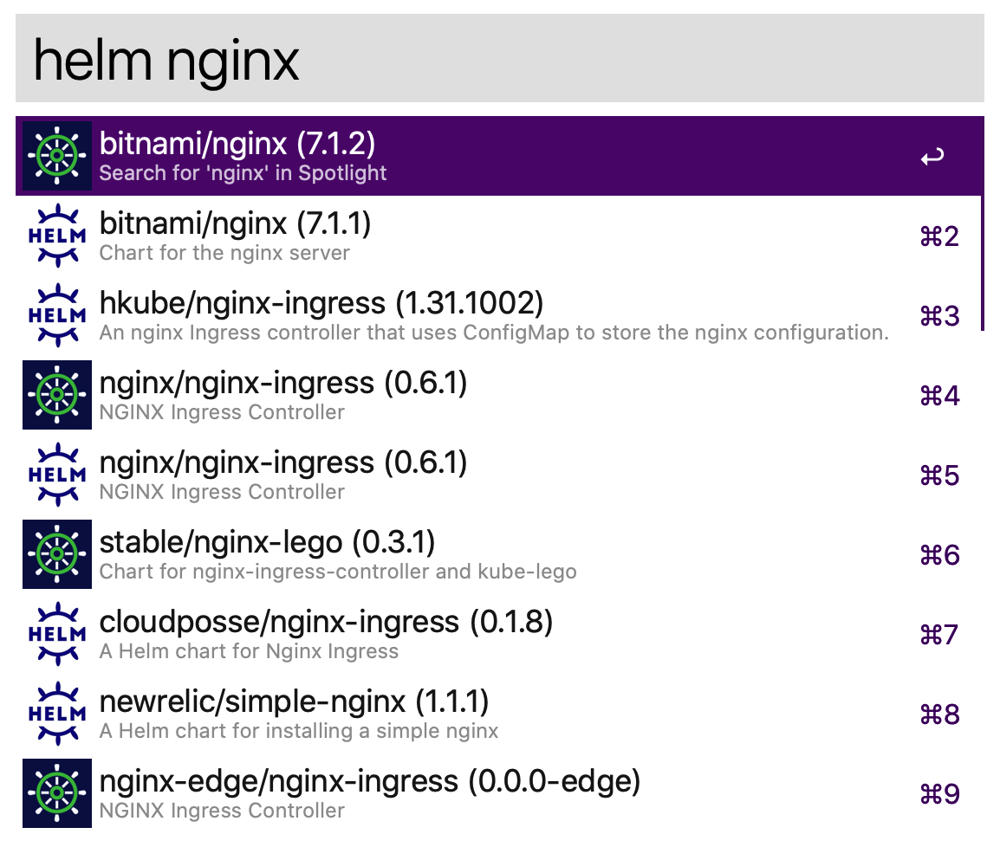
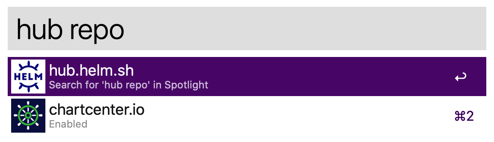

# alfred-helm-hub
Quickly search Helm charts from Helm Hub via Alfred workflow

Supports Alfred 4 on macOS 12.3+ (Python 3.8+).

## ⚠️ Using this workflow on macOS 12.3+ Monterey
[2.0.0](https://github.com/bskim45/alfred-helm-hub/releases/tag/2.0.0)
is the first version that supports macOS 12.3+ (Python 3.8+).  
Please upgrade your workflow version to 2.0.0 or later
if you are using macOS 12.3+.

Feel free to open issues for any troubles regarding this change.

## ⚠️ Note to macOS 12.2 or below users
[1.3.0](https://github.com/bskim45/alfred-helm-hub/releases/tag/1.3.0)
is the last version that supports macOS 12.2 and below (Python 2).  
Please do not upgrade to 2.x version if you are using macOS 12.2 or below.

## Install
[Download latest package from releases](https://github.com/bskim45/alfred-helm-hub/releases/latest/download/alfred-helm-hub.alfredworkflow)

## Usage
Search helm charts from hub

Press `Enter⏎` will open browser and navigate to the chart page.

By default, this workflow shows the results from both `chartcenter.io` and `hub.helm.sh`.
You can toggle this behavior:

Press `Enter⏎` to toggle the results from selected hub repo.

## License
The code is released under the MIT licence. See [LICENSE](LICENSE) for details.

Awesome [alfred-workflow](https://github.com/NorthIsUp/alfred-workflow-py3)
library by [@NorthIsUp](https://github.com/NorthIsUp) is also released under
[MIT License](alfred-workflow/LICENCE.txt).

[alfred-workflow](https://github.com/NorthIsUp/alfred-workflow) is
originally created by [@deanishe](https://github.com/deanishe)
and ported to Python 3 by  [@NorthIsUp](https://github.com/NorthIsUp).
